# [慕课网实战《Socket网络编程进阶与实战》](https://coding.imooc.com/down/286.html) 学习代码

笔记参考

- [有道云笔记](http://note.youdao.com/noteshare?id=8489412fc4e17619d1247ba522d8d373&sub=AFF5FA73188948D7BB9C652744D0CB57) 
- [讨论专区](https://coding.imooc.com/learn/qa/286.html)

码列表如下：

## 1、l2-l6：BIO 数据传输演示

### l2：模拟服务端和客户端【Socket网络编程快速入门】

- Client 客户端
- Server 服务端

### l3：upd API 示例【Socket UDP快速入门】

1. UDPProvider：服务提供端，监听 UDP 广播，回复自己的地址和一个特定的 sn。
2. UDPSearcher：服务搜索端，发送一个广播，然后与解析广播的回复。

### l4：tcp API 示例【Socket TCP快速入门】

- Client 客户端【实例中涉及到 Client Socket 的详细配置】
- Server 服务端【实例中涉及到 ServerSocket 的详细配置】

### l5：tcp udp 配合示例

1. TCP 客户端事先不知道 TCP 服务端的 IP 和端口。
2. TCP 服务端提供了通过 UDP 提供 TCP 服务端 IP 和端口的服务，TCP 客户端事先知道服务端 UDP 的端口。
3. 客户端通过发送广播获取 TCP 服务端的 IP 和 TCP 服务端口。然后建立 TCP 连接。
4. UDP 连接中有对口令进行校验，使用口令用于防止非法连接。

### l6：聊天室

基于 l5 代码完成的一个建议聊天室，但是还存在下面缺点：

- 粗略的实现，客户端于服务器之间只能传输一行行的文本。
- 通信的双方没有制定任何协议。
- 服务器线程数量：一个客户端需要 2 个线程，n 个客户端需要 `2*n+` 线程。==大部分线程都处于等待。CPU 需要扫描所有线程的状态==，但==大部分线程还是等待中的。

## 2、l7：NIO 改写服务器

### l7-01-nio-server

使用 NIO 重写了 l6 中的服务器实现。但是还是存在以下问题：

1. 服务端仅仅是将同步的方式改为异步的方式，并没有减少服务端线程的数量。
2. 所以，这部分的代码，仅仅是体验非阻塞 NIO 的使用。

### l7-02-clink-api【这一步骤的代码很关键，后续扩展就是基于此】

进一步，根据 NIO，定义一套 Socket 通讯 API，为后续服务端线程优化打下基础。`clink 包`
目标是把连接内部调度、包的组装、心跳组合成一起，上层只需要调度发送、接收，就可以知道具体哪个连接发送数据来了，或者发送数据到哪个连接了，而不同具体的、数据层面的、Buffer 层面的、字节层面的过程、不必关心 SocketChannel 与
Buffer 的衔接过程：

clink 包下各个核心组件功能描述如下:

- `clink.core.`
    - `IoContext`：整套 API 的上下文，用于启动框架。
    - `Sender`：定义了数据发送功能，发送的是 IoArgs 承载的数据。
    - `Receiver`：定义了数据接收功能，通过 IoArgs 来接收数据。
    - `IoArgs`：IO 读写参数，进行读或写时，用 IoArgs 来承载数据，内部封装的时 ByteBuffer。
    - `Connector`：代表一个 SocketChannel 连接，创建时需要一个代表客户端的 SocketChannel，然后内部实例化 SocketChannelAdapter，用于调用 Sender 和 Receiver
      执行读写操作。
    - `IoProvider`：IO 读写调度器，可以把关心 `可读/可写` 的 SocketChannel 注册给 IoProvider，并提供一个回调，当`可读/可写`
      时，对应的回调将会被调用，每一次读写回调后，需要重新注册读写事件。
- `clink.impl`
    - `IoSelectorProvider`：是 IoProvider 的实现者，内部使用 Selector 来实现非阻塞的 IO 调度。
    - `SocketChannelAdapter`：实现了 Sender, Receiver, 即使用 SocketChannel 来实现 Sender, Receiver 定义的数据读写功能。

**服务端调用概要流程说明**：

1：在服务启动器 Server 类中，服务端首先通过 IoContext 初始化这个异步 IO 框架，其实就是传入核心的 IOProvider 实现，然后调用 TCPServer 启动 ServerSocket 开始服务。

```
//启动IoContext
IoContext.setup()
    .ioProvider(new IoSelectorProvider())
    .start();
```

2：TCPServer 服务端开始开启一个线程，进入 accept 状态

```
boolean start(){
    try{
        mSelector=Selector.open();
        mServerSocketChannel=ServerSocketChannel.open();
        mServerSocketChannel.configureBlocking(false);//配置非阻塞
        mServerSocketChannel.bind(new InetSocketAddress(mPortServer));
        mServerSocketChannel.register(mSelector,SelectionKey.OP_ACCEPT);

        System.out.println("服务器信息："+mServerSocketChannel.getLocalAddress());

        //ClientListener 就是一个线程，其工作就是不断地询问 Selector 是否有新的客户端需要建立连接。
        ClientListener clientListener=new ClientListener();
        clientListener.start();
        mClientListener=clientListener;
        return true;
    }catch(IOException e){
        e.printStackTrace();
        return false;
    }
}
```

3：每当建立一个连接，TCPServer 就会创建一个对应的 ClientHandler 去处理与客户端的读写交互

```
SocketChannel socketChannel=serverSocketChannel.accept();
//创建 ClientHandler 处理客户端读写
try{
    ClientHandler clientHandler=new ClientHandler(socketChannel,mClientHandlerCallback);
    synchronized (TCPServer.this){
        mClientHandlers.add(clientHandler);
    }
}catch(IOException e){
    //抓住异常，继续处理下一个。
    System.out.println("客户端连接异常："+e.getMessage());
}
```

4：ClientHandler 内部会创建一个代表连接的 Connector，Connector 具有读/写数据的功能。

- 读数据功能：只要实现 Connector 的 onReceiveNewMessage 方法，当有新消息时，就会该方法就会被调用。
- 写数据功能：事实上，这个版本 Connector 并没有实现写功能，所以这部分功能暂时由 ClientHandler 自己实现。

```
ClientHandler(SocketChannel client,ClientHandlerCallback clientHandlerCallback)throws IOException{
        mClient=client;
        mClientHandlerCallback=Objects.requireNonNull(clientHandlerCallback);
        
        //创建连接器并设置
        mConnector=new Connector(){
            @Override
            public void onChannelClosed(SocketChannel channel){
                super.onChannelClosed(channel);
                exitBySelf();
            }
            
            @Override
            protected void onReceiveNewMessage(String newMessage){
                super.onReceiveNewMessage(newMessage);
                mClientHandlerCallback.onNewMessageArrived(ClientHandler.this,newMessage);
                }
            };

        mConnector.setup(mClient);

        ...
}
```

**clink NIO 框架工作流程说明**：

1：IoSelectorProvider 的初始化：

1. IoSelectorProvider 是 IoProvider 的实现者，IoProvider 是 IO 读写调度器，可以把关心 `可读/可写` 的 SocketChannel 注册给
   IoProvider，并提供一个回调，当`可读/可写`时，对应的回调将会被调用。
2. IoSelectorProvider 作为 IoProvider 的实现者，利用的是 NIO 中的 Selector 来实现 IO 读写调度器。
3. IoSelectorProvider 在初始化后，就创建了两个独立线程和两个线程池。
    - 【一个监线程 + 一个线程池】配合工作，用于完成读或写操作。
    - 一个线程通过 Selector 不断地问系统当前是否可以进行写操作，当系统有资源处理进行要求的写操作后就会返回，然后这个线程将写操作交给具体的线程池执行。【读操作类似】
4. 至此 IoSelectorProvider 就启动起来了，后续 Connector 可以把关心 `可读/可写` 的 SocketChannel 注册给 IoProvider，并提供一个回调，当`可读/可写`时，对应的回调将会被调用。

2：Connector 的工作流程：

1. Connector 表示一个连接，建立好连接就可以精想读写操作了，那么 Connector 也应该具备读写数据的功能。
2. 事实上，读写数据的功能抽象在 Sender 和 Receiver 上，因此 Connector 是持有这两个类型的具体实例的。
3. Sender 和 Receiver 是两个接口，分别定义了异步发送数据和读取数据的功能，而 SocketChannelAdapter 同时实现了 Sender 和 Receiver 这两个接口。
4. 所以 Connector 在初始化时就创建了 SocketChannelAdapter 对象，并传入 IoProvider，以为 SocketChannelAdapter 需要 IO 调用功能。
5. 至此，Connector 就完成了初始化，后续框架使用者就可以调用 Connector 的读写功能进行收发数据。

**现阶段 clink NIO 框架总结**：因为 NIO 的阻塞式使用起来比较繁琐，clink 尝试将这 NIO 的使用封装起来，对外框架使用者提供异步 IO 的调度能能够，不过现在 clink 的实现还很粗糙，还存在下面问题：

1. Connector 只提供了异步读的功能，并没有实现异步写的功能【暂时由 ClientHandler 实现】。
2. 没有定义具体的通信协议，还是只能传输简单的文本数据，很容易发送粘包，消息不完整的问题。
3. 关于 IOSelectorProvider 中，多线程安全的疑问。waitSelection 方法中的等待应该用 while，unRegisterSelection 方法也应该保证线程安全。

如果对这部分封装还有不理解，也可以参考 [对第七章结束代码的理解](https://coding.imooc.com/learn/questiondetail/204073.html)

## 3、l8：复现粘包，消息不完整的问题

**l8-q1**：模拟同一个消息反复收到消息到达的回调，修改内容如下：

- IoSelectorProvider：注释了 `selectionKey.interestOps(selectionKey.readyOps() & ~keyOps);`
- SocketChannelAdapter：mHandleInputCallback 中延迟处理消息

**l8-q2**：模拟消息粘包的问题，修改内容为在 TCPClient 中，客户端连续发送四条消息，服务器将其当作一条消息处理。

```
private static void write(Socket client)throws IOException{
        BufferedReader bufferedReader=new BufferedReader(new InputStreamReader(System.in));
        try(PrintStream printStream=new PrintStream(client.getOutputStream())){
        String line;

        //制造问题，发送多个消息，服务器会把这四个消息当成一个消息
    while(!(line=bufferedReader.readLine()).equalsIgnoreCase("00bye00")){
            System.out.println("TCPClient send: "+line);
            printStream.println(line);
            printStream.println(line);
            printStream.println(line);
            printStream.println(line);
            printStream.flush();
        }
    }
}
```

**l8-q3**：模拟单消息不完整问题，修改内容为将 IoArgs 容量改为 4 个字节，模拟单消息不完整问题。

```
public class IoArgs {

    //TODO，容量改为 4 个字节，模拟单消息不完整问题
    private byte[] byteBuffer = new byte[4];
    private ByteBuffer buffer = ByteBuffer.wrap(byteBuffer);

    //TODO，去掉减去换行符的逻辑
    public String bufferString() {
        return new String(byteBuffer, 0, buffer.position() /*- CharUtils.LINE_BREAK_LENGTH*/ /*丢弃换行符*/);
    }
    
    ..
}
```

IoArgs 容量改为 4 个字节后，客户端如果发送的消息超过了 4 个字节，那么这个消息就会分多次发出，这样服务端就以为收到了多个消息。

## 4、l8-chat-room-v1-bytes：【为了解决丢包和粘包问题】

为了解决丢包和粘包问题，需要：

- 对数据包进行分析与特征提取。
- 构建数据头，用于包的拆分和再组装。
- 处理好数据头、数据体接收。

另外，在 l8-chat-room-v1-bytes 版本的代码中，Connector 完善了异步写数据的功能。

### 类的功能与职责

基于以上分析，初步定义了`长度 + 实体`的协议，并提出 Packet 概念，一个 Packet 代表一个完整的消息，每次发送 Package
时，先发送包的长度，再发送包的实体数据。接收端，每次先读取包的长度，然后再读取包的实体数据，读完指定的长度后，就组装好一个包。

- `clink.core.Packet`：公共的数据封装（消息类型，消息长度），提供了类型以及数据长度的定义。
- `clink.core.SendPacket`：公发送包的定义
- `clink.core.ReceivePacket`：接收包的定义，不同的数据类型对应不同的 ReceivePack 实现。
- `clink.box.StringReceivePacket`：字符串接收包。
- `clink.box.StringSendPacket`：字符串发送包。

Connector：代表一个 Socket 连接，其主要工作如下：

- Connector 的创建需要一个 SocketChannel。
- 通过 SocketChannel 实例化 SocketChannelAdapter。SocketChannelAdapter 是 Sender 和 Receiver 的实现者，具有发送和接收数据功能。
- 通过 Sender 创建发送调度则 SendDispatcher。
- 通过 Receiver 创建接收调度则 ReceiveDispatcher。

数据的接受和发送流程：

- IoProvider 负责具体的调度，内部有两个 Selector，分别用于选择可读和可写的 Channel。
- Sender 和 Receiver 的实现者 SocketChannelAdapter 向 IoProvider 注册可读可写回调。
- 当可读或者可写时，IoProvider 通过回到回调通知到 SocketChannelAdapter，即 Sender 和 Receiver。

String 的接收和发送：

- 接收 String：接受到的是 StringReceivePacket，然后解析为 String。
- 发送 String：通过将 String 封装为 StringSendPacket 进行发送。

SendDispatcher，发送调度器：

- SendDispatcher 负责发送的调度，调用 Sender 的进行数据发送。
- SendDispatcher 主要职责是：维护发送包的队列；对每个包进行拆分发送。
- SendDispatcher 的实现者是 AsyncSendDispatcher

ReceiveDispatcher，发送调度器：

- ReceiveDispatcher 负责接收数据的调度，调用 Receiver 的进行数据接收。
- ReceiveDispatcher 主要职责是：在接受数据的过程中，按照头部信息将数据组装成一个完整的包。
- ReceiveDispatcher 的实现者是 AsyncReceiveDispatcher

> SendDispatcher 和 ReceiveDispatcher 非常总要，负责 Package 的排队、组装等功能，有了这两个类，SocketChannelAdapter 就可以专注于 IO 调用了。

IoArgs：

- 发送和接收数据的载体，内部维护者一个 ByteBuffer。
- 从 Channel 读取数据到自身，将自身的数据写入到 Channel。

### 解决了哪些问题

通过 `长度 + 实体` 的约定，解决了丢包和粘包的问题。

### 存在问题

**1 IoArgs 的实现**：

```
/**
 * 从 SocketChannel 读取数据，保证将 IoArgs 读满。
 */
public int readFrom(SocketChannel socketChannel)throws IOException{
    startWriting();
    int bytesProduced=0;
    //TODO：这种死循环的方式应该是不合理的。
    while(buffer.hasRemaining()){
        int readLength=socketChannel.read(buffer);
        if(readLength< 0){//无法读取到更多的数据
        throw new EOFException();
        }
        bytesProduced+=readLength;
    }
    finishWriting();
    return bytesProduced;
}

/**
 * 写数据到 SocketChannel，保证将 IoArgs 中现有数据全部写出去。
 */
public int writeTo(SocketChannel socketChannel)throws IOException{
    int bytesProduced=0;
    //TODO：这种死循环的方式应该是不合理的。
    while(buffer.hasRemaining()){
        int writeLength=socketChannel.write(buffer);
        if(writeLength< 0){//无法读取到更多的数据
        throw new EOFException();}
        bytesProduced+=writeLength;
    }
    return bytesProduced;
}
```

正如注释中讲到的，采用死循环的方式强制读写完一定数量的数据应该是不合理的。

**2 目前只支持接收 String 包**

## 5、l9-chat-room-v2-stream：【支持文件传输】

### 文件传输与普通传输的区别

文件可能很大，文件数据 bytes 远远大于普通数据 bytes，不能一次性将文件加载到内存，因此要考虑以下问题：

- **并行发送能力**：同一个 Socket 连接中，要保证文大件传输中途取消而不影响后续其他的 packet 发送。传输大文件的时候，可以同时进行文本传输。
- **数据安全性**：文件传输校验，保证数据准确性。

为了支持支持文件传输，现在将基于 bytes 的传输方法改为基于 stream 传输。 概要调整如下：

- Packet 改成流传输。
- IoArgs 支持流的读写。

### Packet 类的调整

Packet 改成了基于 Stream 传输数据。

```log
Packet (clink.core)
    |--SendPacket (clink.core)
    |       |--BytesSendPacket (clink.box)
    |       |       |--StringSendPacket (clink.box)
    |       |--FileSendPacket (clink.box)
    |--ReceivePacket (clink.core)
    |       |--AbsByteArrayReceivePacket (clink.box)
    |       |       |--StringReceivePacket (clink.box)
    |       |       |--BytesReceivePacket (clink.box)
    |       |--FileReceivePacket (clink.box)
```

- `Packet<Stream extends Closeable>`：基于 Stream 的 Packet，不同的 Packet 对应不同 Stream。
- `SendPacket<Stream extends InputStream> extends Packet<Stream>`：发送包基于 InputStream。
- `BytesSendPacket extends SendPacket<ByteArrayInputStream>`：基于 ByteArrayInputStream 的发送包，主要用于可直接加载到内存的小数据传输。
- `StringSendPacket extends BytesSendPacket`：String 发送时直接转换为字节进行发送。
- `FileSendPacket extends SendPacket<FileInputStream>`：文件则通过文件流进行发送。
- `ReceivePacket<Stream extends OutputStream, Entity> extends Packet<Stream>`：接收包基于 OutputStream，Entity
  消息的最终表现类型，比如文件、字符串。
- `AbsByteArrayReceivePacket<Entity> extends ReceivePacket<ByteArrayOutputStream, Entity>`：定义最基础的基于
  ByteArrayOutputStream 的输出接收包
- `StringReceivePacket extends AbsByteArrayReceivePacket<String>`：String 也是通过读取字节进行接受的。
- `BytesReceivePacket extends AbsByteArrayReceivePacket<byte[]>`：纯 byte 数组接收包。
- `FileReceivePacket extends ReceivePacket<FileOutputStream, File>`：文件接收包，通过 FileOutputStream 接收文件。

### IoArgs 类的调整

```java
//读或写准备就绪的回调，每一次读或者写的都会先调用 {@link #onStarted(IoArgs)}，单词读写完成，则调用 {@link #onCompleted(IoArgs)}。
public interface IoArgsEventListener {

    void onStarted(IoArgs args);

    void onCompleted(IoArgs args);
}

//IoArgs 提供者、处理者；数据的生产或消费者。定义为这种形式，用于异步处理IO。
public interface IoArgsEventProcessor {

    //提供一份可消费的IoArgs
    IoArgs provideIoArgs();

    //消费失败时回调
    void consumeFailed(IoArgs ioArgs, Exception e);

    //消费成功
    void onConsumeCompleted(IoArgs args);
}
```

IoArgs 中的 IoArgsEventListener 调整为 IoArgsEventProcessor，调整之后有两个好处：

- 可以处理消费 IoArgs 失败的情况。
- 延迟了 IoArgs 对数据的读取（只在可写的情况下才去填充 IoArgs）。

### 存在的问题

基于流的文件传输有以下问题：

1. 发送中无法取消文件发送（长度消息-->对应长度的数据）。
2. 大文件传输容错率较低，无法分段校验文件。
3. 同一个连接中，无法实现文件和普通消息优先级，一个包必须等待另一个包发送完毕才能发送，即不具有具备并行收发数据的能力。

## 6、l9-chat-room-v3-sharding ：基于 frame 的数据传输【支持文件传输，并行收发数据】

### 为什么进行包的分片

为什么要对包进行分片：

- 不能一次性将文件加载到内存。
- 同一个 Socket 连接中：
    - 要保证文大件传输中途取消而不影响后续其他的 packet 发送。
    - 传输大文件的时候，可以同时进行文本传输。
- 数据安全性：文件传输校验，保证数据准确性。

**因此在 Package 的基础上，再进一步将 Package 细化 Frame（帧）**， Frame 的继承体系：

```log
Frame (clink.core)
    |--AbsSendFrame (clink.frame)
    |       |--AbsSendPacketFrame (clink.frame)
    |       |       |--SendEntityFrame (clink.frame)
    |       |       |--SendHeaderFrame (clink.frame)
    |       |--CancelSendFrame (clink.frame)
    |--AbsReceiveFrame (clink.frame)
    |       |--ReceiveHeaderFrame (clink.frame)
    |       |--ReceiveEntityFrame (clink.frame)
    |       |--CancelReceiveFrame (clink.frame)
```

- `Frame(clink.core)`：定义 Frame 的基本信息，类型，协议等等。
- `AbsSendFrame (clink.frame)`：定义发送的基本行为。
- `AbsSendPacketFrame (clink.frame)`：基于 AbsSendFrame，支持中断传输。
- `SendHeaderFrame (clink.frame)`：
- `SendEntityFrame (clink.frame)`：
- `CancelSendFrame (clink.frame)`：用于取消发送
- `AbsReceiveFrame (clink.frame)`：
- `ReceiveEntityFrame (clink.frame)`：
- `CancelReceiveFrame (clink.frame)`：
- `ReceiveHeaderFrame (clink.frame)`：

引入帧的概念后，应用层的数据将以帧为单位进行传输，为了支持帧的传输【帧的拆分和重组】，这里改进了传输协议，因为原来的 `长度 + 实体` 的简陋协议无法支持帧的并行传输与组装。具体协议如下：

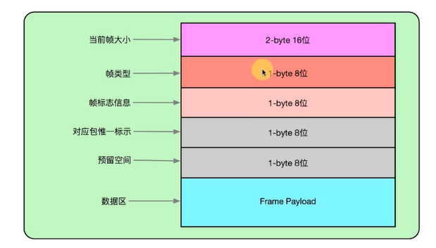

### 分片的接收、发送、组装

- AsyncPacketReader 负责 Frame 的发送
- AsyncPacketWriter 负责 Frame 的接收

### 发送数据的优先级

BytePriorityNode 链表结构用于支持分片的优先级传输，所有要发送的分片都先加入到 BytePriorityNode 中。

### 三层传输架构

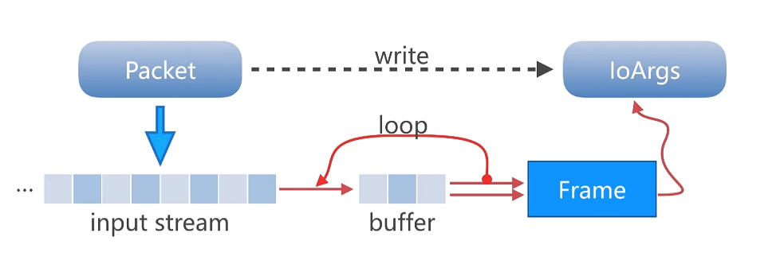

### 框架梳理

那些类只存在单个实例？

1. IoSelectorProvider：用与提供 I/O 调度，内部有两个线程池，分别用于执行真正的 I/O 读写。

那些类存在多个实例？

1. 一个连接对应一个 Connector。
2. 一个 Connector 对应一个 SocketChannelAdapter、AsyncReceiveDispatcher、AsyncSendDispatcher。
    1. 其中 SocketChannelAdapter 只关心 IoArgs 层面的读写。
    2. AsyncReceiveDispatcher、AsyncSendDispatcher 只关心 Package 层面的收发。
    3. AsyncReceiveDispatcher 对应一个 AsyncPacketWriter，只关心帧级别的接收工作。
    4. AsyncSendDispatcher 对应一个 AsyncPacketReader，只关心帧级别的发送工作。

并行收发数据说明：

1. 首先要明确，一个连接只有一个读/写通道，这个层面来讲，是不存在对同一个连接进行真正的并发操作的。
2. AsyncPacketReader 和 AsyncPacketWriter 都做了并发控制。
3. 所谓的并发送是指：在将包切割成若干个帧后，可以将多个包的若干个帧一起加入到队列中，不同的线程交替请求调度 I/O，交替地发送数据。
4. 与接收数据是被动的，这取决于发送方时如何发送数据的。

## 7、l10-chat-room-v4-optimize：【并发优化、心跳包、聊天室开发】

基于 chat-room-v3-sharding 的优化版本。

### 解决 Java NIO 中并发环境下的 Selector 可能存在的并发问题

#### IOSelectorProvider 中的并发问题

在 JAVA NIO 中，当某个线程调用 `Selector.select()` 时，`select()` 方法内部实现其实就是对已经注册的 Channel 队列的进行反复地扫描，如果扫描完一遍没有发现就绪的 channel
则继续进行扫描，如果有则从 `select()` 函数返回。在扫描的这个过程中，是不允许其他线程更改其内部队列的，比如：

- 比如调用 Selector 的 `register()` 方法
- 获取 Selector 内部 SelectionKey 然后调用其的 `interestOps()` 方法
- 对 Selector 已选择的 SelectionKey 集合进行 `clear()` 操作

如果在扫描过程中其他线程调用方法修改 Selector 内部的队列，可能导致线程阻塞，所以如果想要调用以上方法，应该下先调用 Selector 的 `wakeup()` 方法，让 Selector 立即从 `select()`
方法返回，从而避免这个可能的并发 bug。

> 对于这个问题，可以在调试模式下运行 `l9-chat-room-v3-sharding` 中的 PressureTester，一段时间后其就会进入阻塞无响应的阻塞状态，然后点击下图中的快照按钮获取线程状态。
> 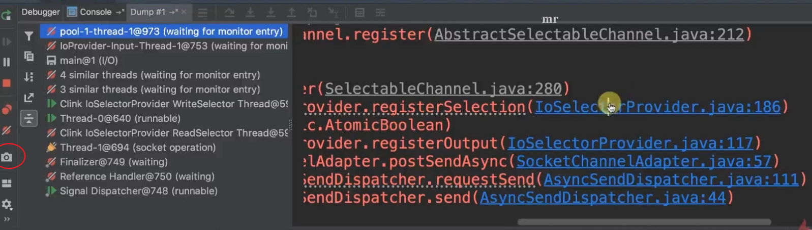

对此问题，stackoverflow
上也有讨论，具体参考 [java-non-blocking-io-selector-causing-channel-register-to-block](https://stackoverflow.com/questions/3189153/java-non-blocking-io-selector-causing-channel-register-to-block)
。

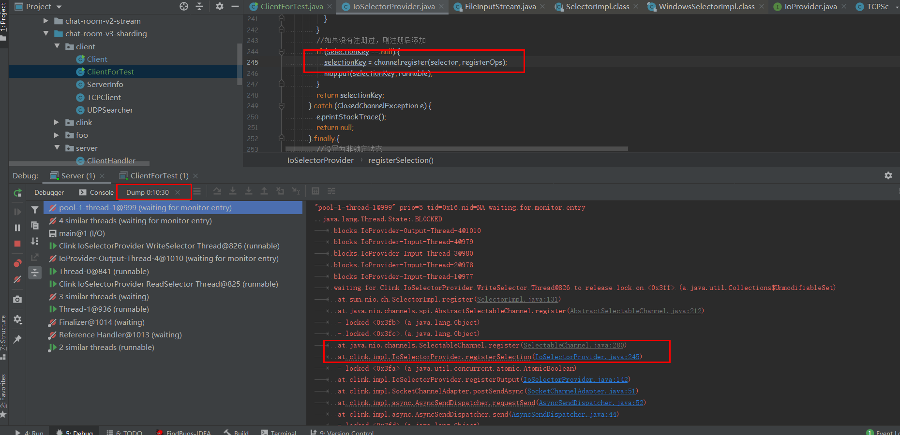

虽然之前的程序实现中，IoSelectorProvider 有相关代码处理这个问题

```
//select 部分
if (readSelector.select() == 0) {
    waitSelection(inRegInput);
    continue;
}

private void waitSelection(AtomicBoolean locker) {
    //noinspection SynchronizationOnLocalVariableOrMethodParameter
    synchronized (locker) {
        //如果处于 locker 所表示的状态，让该线程等待。
        if (locker.get()) {
            try {
                locker.wait();
            } catch (InterruptedException e) {
                e.printStackTrace();
            }
        }
    }
}

//修改 Selector 的部分
private SelectionKey registerSelection(SocketChannel channel, Selector selector, int registerOps,
        AtomicBoolean locker, Map<SelectionKey, Runnable> map, Runnable runnable){
    //要求线程安全
    //noinspection SynchronizationOnLocalVariableOrMethodParameter
    synchronized (locker){
        //设置位锁定状态
        locker.set(true);
        try{
            // 唤醒当前的selector，让selector不处于select()状态
            selector.wakeup();
        }
    }
}
```

但是还存在下面问题。

**1 Selector 线程进入阻塞的条件优化**：

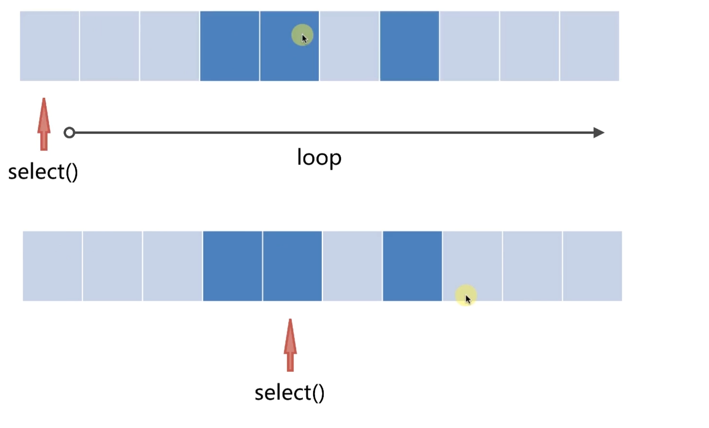

之前的 Selector 线程进入阻塞的条件是 `readSelector.select() == 0`，如上图所示，底层 select 可能以及扫描到 一些可以进行 I/O 调度的 Key，所以 wakeup 后，select
方法不一定只返回 0。

修改后的逻辑如下：

```
//阻塞等待可写
if (selector.select() == 0) {
    waitSelection(locker);
    continue;
} else if (locker.get()) {
    //如果 locker 为 true，说明正在操作 Selector 中的队列，此时依然需要先挂起，防止 Selector 进入 select 操作，等待操作完成再继续 select。
    waitSelection(locker);
}
```

**2 之前 unRegisterSelection 方法没有加上同步，现在也加上了**

**3 之前 handleSelection 方法中也对 Selector 的 key 做了操作，同样需要加同步**

**4 并发修改异常的优化**：在迭代 select 返回的 key 时，从 for 循环的发送改为迭代器的方式。

```
//获取到可写的 SelectionKey，readSelector
Set<SelectionKey> selectionKeys = selector.selectedKeys();
Iterator<SelectionKey> iterator = selectionKeys.iterator();
//这里使用迭代器，而不是for循环，因为正在迭代的 key 能被取消（remove）掉，从而导致可能的并发修改异常。
while (iterator.hasNext()) {
    SelectionKey key = iterator.next();
    //有两种情况从select中返回：
    //select遍历获取到了符合注册条件的key
    //wakeup
    //注册 selector 的 channel 被关闭的，这个 channel 的key 会被返回，进入到读写流程，出些读写异常，从而得知连接中断
    if (key.isValid()) {
        handleSelection(key, keyOps, map, service, locker);
    }
    iterator.remove();
}
```

##### IoArgs BufferOverflowOverflow。

AsyncSendDispatcher 中 requestSend 没做做到足够的同步保护。从而导致 AsyncPacketReader 的 fillData 方法会被并发地调用。

`l9-chat-room-v3-sharding` 中 AsyncPacketReader 的 fillData 方法如下，如果并发地调用，会导致 mIoArgs 被多线程竞争。

```
IoArgs fillData() {
    //没有数据了，则返回null
    Frame currentFrame = getCurrentFrame();
    if (currentFrame == null) {
        return null;
    }

    try {
        //返回 true 表示该帧的数据消费完了，handle 方法是同步的。
        if (currentFrame.handle(mIoArgs)) {
            Frame nextFrame = currentFrame.nextFrame(); //nextFrame 方法是同步的

            if (nextFrame != null) {
                appendNewNode(nextFrame);
            } else if (currentFrame instanceof SendEntityFrame) {//是实体帧，且它的 nextFrame 为 null，则说明其对应的包发送完了。
                mPacketProvider.completedPacket(((SendEntityFrame) currentFrame).getPacket(), true);
            }

            //既然当前帧发完了，就弹出来
            popCurrentFrame();
        }

        return mIoArgs;
    } catch (IOException e) {
        e.printStackTrace();
    }
    return null;
}
```

在 `l10-chat-room-v4-optimize` 中，优化了 AsyncPacketReader 的逻辑。

#### 内存泄漏

待服务端运行一段时间后，使用 VisualVM 查看内存服务端内存状态，可以发现： 内存不断地持续增长，回收变得缓慢。

主要原因为在控制台打印了大量数据，JVM 不会回收在控制台打印的数据。

#### IoArgs 优化

IoArgs 不再无脑地循环，一定要将数据填满或者写完，而是支持只写出一部分或者读取一部分，而这个中间状态的处理交给了 SocketChannelAdapter 处理。

```
/**
 * 从SocketChannel读取数据
 */
public int readFrom(SocketChannel socketChannel) throws IOException {
    ByteBuffer localBuffer = this.buffer;
    int bytesProduced = 0;
    int len;
    // 读取或写数据到Socket原理
    // 回调当前可读、可写时我们进行数据填充或者消费
    // 但是过程中可能SocketChannel资源被其他SocketChannel占用了资源（网卡把资源让给了另外一个SocketChannel）
    // 那么我们应该让出当前的线程调度，让应该得到数据消费的SocketChannel的到CPU调度
    // 而不应该单纯的buffer.hasRemaining()判断
    do {
        len = socketChannel.read(localBuffer);
        if (len < 0) {//无法读取到更多的数据
            //Selector 选择后却又读不到数据，说明连接出问题了
            throw new EOFException("Cannot read any data with:" + socketChannel);
        }
        bytesProduced += len;
    } while (localBuffer.hasRemaining() && len != 0);

    return bytesProduced;
}

/**
 * 写数据到SocketChannel
 */
public int writeTo(SocketChannel socketChannel) throws IOException {
    int bytesProduced = 0;
    ByteBuffer localBuffer = this.buffer;
    int writeLength;

    // 读取或写数据到Socket原理
    // 回调当前可读、可写时我们进行数据填充或者消费
    // 但是过程中可能SocketChannel资源被其他SocketChannel占用了资源
    // 那么我们应该让出当前的线程调度，让应该得到数据消费的SocketChannel的到CPU调度
    // 而不应该单纯的buffer.hasRemaining()判断
    do {
        writeLength = socketChannel.write(localBuffer);
        if (writeLength < 0) {//无法读取到更多的数据
            //Selector 选择后却又写不出数据，说明连接出问题了
            throw new EOFException("Current write any data with:" + socketChannel);
        }
        bytesProduced += writeLength;
    } while (buffer.hasRemaining() && writeLength != 0);

    return bytesProduced;
}
```

### 聊天室开发

具体可擦汗看代码，采用了责任链模式。

### 心跳包

- `clink.core.frame.HeartbeatSendFrame`
- `clink.core.frame.HeartbeatReceiveFrame`

## 8、l11-chat-room-v4-bridge：【直流包与交桥接技术实现】

1. 引入直流传输。
2. 为支持直流传输，引入桥接数据。

## 9、l11-chat-room-v5-fixed：【性能优化与 bug 修复】

多线程调度瓶颈：

1. 对于多核计算机而言，发挥计算机速度的手段则是多 CPU 并行。
2. 并行-多线程-数量并非越多越好。
3. 对于单核计算机而言，是通过 CPU 切换时间片实现多线程调度，但并非多线程并行-实则串行。
4. 对于多核 CPU，但有临界值存在，则需要尽可能少的长时间占用临界资源。
5. 司步块缩小范围，或同步块让线程独占。
6. 多 Selector 代替单 Selector，Selector 内部自循环自消费。

### 压测程序

压测程序 PressureTester 说明

```java
public class PressureTester {

    /*
    不考虑发送消耗，并发量：
        2000*4/400*1000 = 2w/s 算上来回 2 次数据解析：4w/s
        2000 个客户端 4 个线程每 400 毫秒发送一次数据。
     */
    private static final int CLIENT_SIZE = 2000;
    private static final int SEND_THREAD_SIZE = 4;
    private static final int SEND_THREAD_DELAY = 400;

}
```

优化步骤：

1. 服务端分析并发量，统计统计每两秒钟刷新一次，查看每两秒发送的数据量。
2. 用 VisualVM 查看线程状态和内存占用 。
3. dump 出线程状态进行分析。

### 优化 SocketChannelAdapter【减少阻塞】

启动客户端和服务器，分别使用 VisualVM 查看客户端状态

客户端，大量 IO 调度线程长期处于阻塞状态。

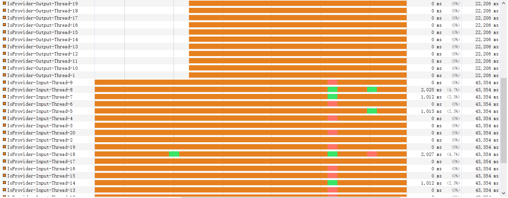

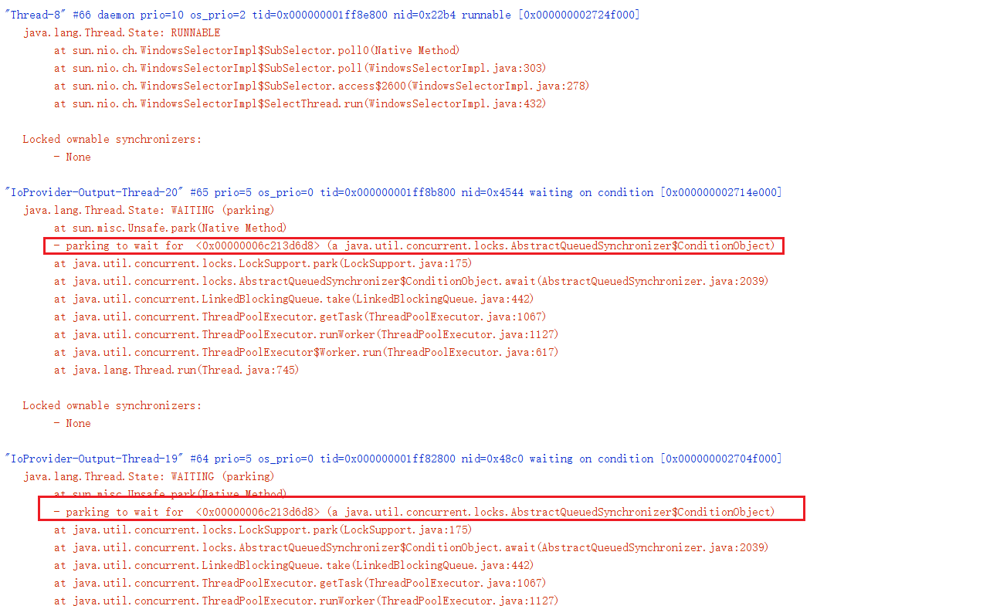

优化点：

```
@Override
public boolean postSendAsync() throws IOException {
    //检查是否已经关闭。
    checkState();
    //进行 Callback 状态监测，判断是否处于自循环状态。
    outputCallback.checkAttachNull();

    //向 IoProvider 注册读回调，当可写时，mHandleOutputCallback 会被回调
    //return ioProvider.registerOutput(channel, outputCallback);

    /*
    TODO：性能优化点 1。
            因为 run 方法可以处理好写数据的逻辑，并且没有写完会自动注册，所以这里第一次不像 IOProvider 注册，而是直接尝试写，避免一次同步操作。
     */
    outputCallback.run();
    return true;
}
```

另外还减少了线程数量：SocketChannelAdapter 中的调度线程从 20 改为 4。优化后的效果

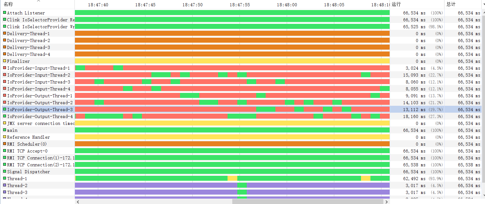

### IoProvider 的优化【单线程 Selector，无锁优化】

新增 SingleSelectorProvider 实现单线程 Selector，优化效果：

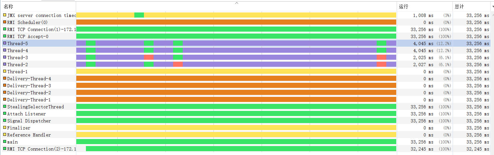

### IoProvider 的优化【多线程任务窃取】

新增 StealingService 实现，优化效果：

## 10、内存复用优化

关注两个方面：

1. 内存抖动：register 方法中，Task 反复创建和销毁，优化反复，复用 Task。
2. 内存溢出：消息队列优化，不无限制存储任务。

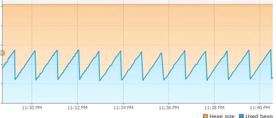

代码参考 [Java-Socket-Latest](../Java-Socket-Latest/README.md)。

## 11、总结与后续后话

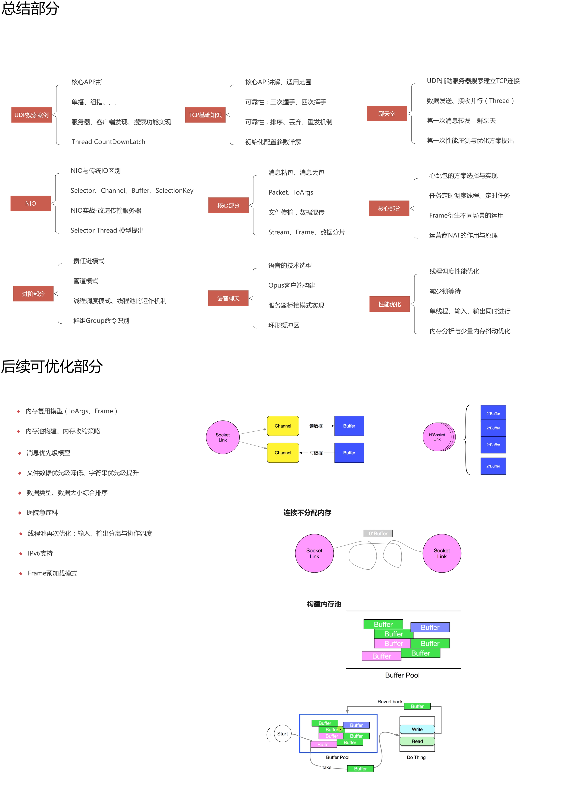
